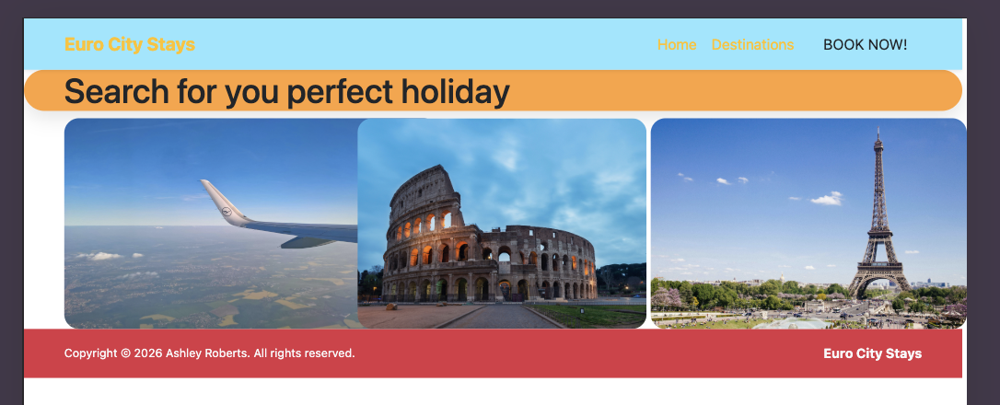
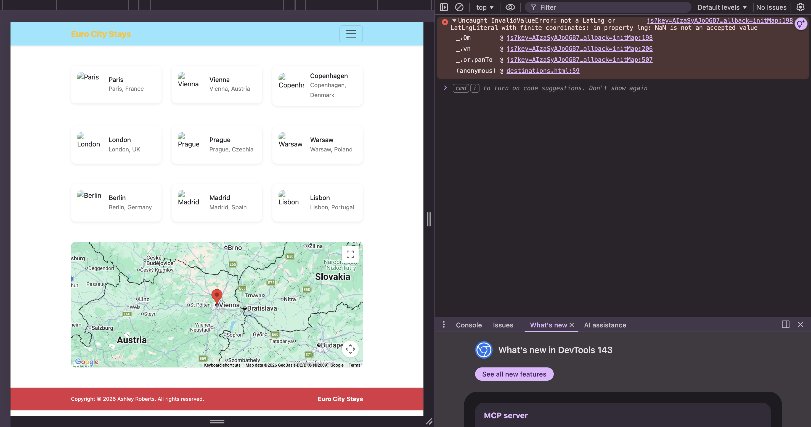

# Euro City Stays

# Introduction

This project is developed for holiday seekers, to have a streamless and pleasent experience when booking and researching for a holiday destination. The project allows users to easily search for different destinations across europe, without confusion. It displays a simple layout to allow users of all computer literacy abilities to be able to use the features displayed with ease. 

Furthermore, this project was built in thought of allowing user to research diffrerent destinations right from within the site. Making booking a destination all the more streamless.  

# Table of Cotents

1. UX
    - Project Goals
    - User Goals
    - User Stories
    - Developer Goals
    - Design Choices
2. Features
    - Existing Features
    - Features To Implement
3. Technologies Used
4. Testing
    - Bugs discovered
5. Deployment
    - How To Run The Project Locally
6. Credits
    - Content
    - Icons
    - Code
    - Images
    - Video
    - Acknowledgements

# UX

## Project Goals

The primary goal of this project is to allow users to have aa simple yet streamless experience when booking a holiday in Europe. I wanted to allow users to be able to easily book a destination whilst being able to research different destinations within the same place. Making booking a holiday a lot easier. 

## User Goals

# Bugs discovered

The first bug I encountered was the images section on index.html page were overlapping on tablet size screens. 

Code used with the issues:

` 

        
      
`

This code was orignally used. I used bootstrap here to try to make the layout responsive on small devices. 

The code to fix it:

The second bug I encountered was when I connected the cards to the google maps API the "Copenhagen" card wouldn't interact with the map. The error is show below:

The code issue was that I put in the `data-lng` class in incorrect. This was the issue code:

`data-lng="'12.5683"`

This is the code that fixed the error:

`data-lng="12.5683"`

