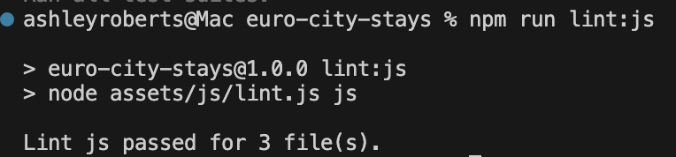
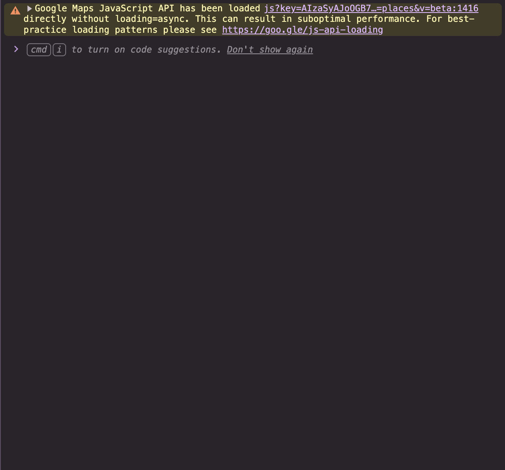

# Euro City Stays

# Introduction

This project is developed for holiday seekers, to have a streamless and pleasent experience when booking and researching for a holiday destination. The project allows users to easily search for different destinations across europe, without confusion. It displays a simple layout to allow users of all computer literacy abilities to be able to use the features displayed with ease. 

Furthermore, this project was built in thought of allowing a user to research diffrerent destinations right from within the site. Making booking a destination more streamless.  

# Table of Cotents

1. [UX](#ux)
    - [Project Goals](#project-goals)
    - [User Goals](#user-goals)
    - [User Stories](#user-stories)
    - [Developer Goals](#developer-goals)
    - [Design Choices](#design-choices)
        - [Figma Designs](#figma-designs)
2. [Features](#features)
    - [Existing Features](#existing-features)
    - [Features To Implement](#features-to-implement)
3. [Technologies Used](#technologies-used)
4. [Testing](#testing)
    - [Code Validation](#code-validation)
    - [Bugs discovered](#bugs-discovered)
    - [Manual Testing](#manual-testing)
    - [Automated Testing](#automated-testing)
    - [JavaScript Unit Testing (Jest)](#javascript-unit-testing-jest)
5. [Deployment](#deployment)
    - [How To Run The Project Locally](#how-to-run-the-project-locally)
6. [Credits](#credits)
    - [Content](#content)
    - [Code](#code)
    - [Images](#images)
    - [API's](#apis)
    - [Acknowledgements](#acknowledgements)

# UX

## Project Goals

The primary goal of this project is to allow users to have a simple yet streamless experience when booking a holiday in Europe. I wanted to allow users to be able to easily book a destination whilst being able to research different destinations within the same place. Making booking a holiday a lot easier. 

## User Goals

As a potential user I want:

- To be able to find information about destinations offered
- To be able easily search diffrent destinations
- To be able to book easily with a clear and easy to understand booking page  

## User Stories

As a potential user I want:

- To be able to view different destinations.
- See available attractions, resturaunts and hotels at specific locations
- Be able to make a booking and easily see a summary of the booking before booking

## Developer Goals

- To create a fun and inviting project for individuals to view exciting destinations
- Create a project that allows quick/ snappy information on different destinations 
- Create a project to 

## Design Choices

### Figma Designs

# Features

## Existing Features

### Images

I included images throughout the project, as this was a key feature to include within the destinations cards. Not only did it make the page look more attaractive, but allows users to see relevant images alongside the information they are receiving.

### Interactive Places Map

This was an important feature I wanted to implement as it added some interactivity to the project. Whilst a simple featue but adding a lot of value to the customer. Being able to see where different places are in terms of there booking planning journey. 

### Booking Form

I included a booking form as part of the user journey despite not being able link it to a payemnt system as it allows the user to see a full summary of there booking experience and also show basic functionality of the site and where it can be developed further.

## Features To Implement

### Link Booking page to payment secure sequence

Although I dont't currently posses the skills to implement a background payment system. I believe to round off this project. It needs to have the complete ability to book and pay for a holiday. As the current project allows the research and ability to set up a booking. This is something that needs to be implemented next in order for the user journey to be completed.

### Map and selected card view on one page view 

As it stands, when a destination card is selected. The user has to scroll down to the bottom of the page, to see the interactive map. To improve UX this feature needs to be implemented so users have all available information directly in front of them.

### Be able to track/ book live flights from home search bar

In order to make this project more accurate. I'd like to implement live flight tracking to the search bar and booking page. This is so when users book holidays through this site. They can be assured that all information is correct and up to date. This also improves the user journey as it continues to add the information already available within the project. 

# Technologies Used

- HTML

HTML5 was used within the index.html, form.html, book.html, destinations.html and thank-you.html files within this project. I used this technology to apply content to my project.

- CSS

CSS3 was used within the style.css file within this project. I used this to style the project with colours, fonts and layout. I also used CSS to re-engineer some bootstrap elements and fontawesome icons to match the styling of my project.

- JavaScript

JavaScript is organised in external files inside `assets/js/` and loaded near the end of each HTML page.
The main interactive logic is in `assets/js/script.js` and is responsible for form handling, map behaviour, booking summary updates, and thank-you page rendering.

- Bootstrap

Bootstrap v5.3 was used within the index.html and the form.html to implement elements such as the navbar, which was re-engnineered using HTML and CSS. I also used Bootstrap to implement the grid layout system througout the project. 

Recently, Bootstrap implemented classes to allow use of flexbox. I implemented some of this within the footer section of the from.html file. 

- Markdown

Markdown language was used within my README.md file. It was used to apply content and apply layout and structure to the file. 

- Jest

Jest is used for JavaScript unit testing in this project. Tests are stored in `assets/js/script.test.js` and run against functions in `assets/js/script.js`.

# Testing

## Testing Approach

For this project I used both manual and automated testing at different stages of development.

Automated testing with Jest was used to test the JavaScript logic, things like form validation, guest counts, URL parameter parsing, and utility functions. This was useful during development as I could quickly check that my functions still worked after making changes, without having to click through the whole site every time.

Manual testing was used to check the parts that automated tests can't easily cover, like how the page looks, whether the map loads correctly, and whether the full user journey from searching to booking confirmation works as expected. I carried this out across different screen sizes using browser chrome developer tools.

## JavaScript Unit Testing (Jest)

To run JavaScript tests:

1. Install Node.js (LTS) if it is not already installed.
2. Run `npm install`
3. Run `npm test`

Included test file:

- `assets/js/script.test.js`

This test suite covers every exported function in `assets/js/script.js`:

- `setupHomePage()`
- `setupGuestsDropdown()`
- `setupDestinationsPage()`
- `initMapWhenReady()`
- `initMap()`
- `attachCardClickHandlers()`
- `autoOpenCityFromSearch()`
- `openCard()`
- `collapseAllCards()`
- `fetchPOIs()`
- `clearPoiMarkers()`
- `hydrateCityImages()`
- `formatType()`
- `setupBookPage()`
- `getBookingParams()`
- `setHeroPhotoWhenReady()`
- `setHeroPhotoFromPlaces()`
- `setupThankYouPage()`
- `titleCaseCity()`

Current test status:

- `19` tests passing in `1` test suite (`npm test`)

## Code Validation 

- 

- 

- 

- 

- 

## Linting (JS, HTML, CSS)

Lint checks are run with:

- `npm run lint:js`
- `npm run lint:css`
- `npm run lint:html`
- `npm run lint`

Latest lint run (`npm run lint`):

- JavaScript: pass (`3` files)
- CSS: pass (`1` file)
- HTML: pass (`4` files)

## Site Screenshots

## Site Loading Times

When planning the project I was conscious on ensuring that the load times for this project were kept optimal. Especially with the inclusion of the video and the images. I used Lighthouse in google dev tools to test this. The results are below. 

## Navigation
Throughout the development of this project. I ensured that all buttons and navigation bar elements were linked correctly and working as intended. Below is a table showing all buttons and routes tested and confirmed to be working correctly. 

| Button | Destination | Working |
|--------|-------------|---------|
|Logo    |Top home page|   Yes   |
|Home    |Top home page| Yes     |
|Destinations    |destinations.html|   Yes   |
|BOOK NOW!   |book.html|   Yes   |
|Search Button| destinations.html| yes|
|Attractions|Drop down menu| Yes |
|Food|Drop down menu| Yes |
|Hotels|Drop down menu| Yes |
|Book Now|book.html| Yes |

## Responsiveness

For this project I used Bootstrap to ensure the majority of the elements were responsive to smaller and medium sized screensizes. 

I also implemented some mediaquery's within the style.css file as I needed to make some more direct styling adjustments to fit all of the content on to smaller mobile screens. Using media query's seperately for this made it easier and more manageable fix. 

## Mobile View

## Tablet View 

# Bugs discovered

The first bug I encountered was the images section on index.html page were overlapping on tablet size screens. 

Code used with the issues:

` 

        
      
`

This code was orignally used. I used bootstrap here to try to make the layout responsive on small devices. 

The code to fix it:

` 

      

        
      
`

The second bug I encountered was when I connected the cards to the google maps API the "Copenhagen" card wouldn't interact with the map. The error is show below:

The code issue was that I put in the `data-lng` class in incorrect. This was the issue code:

`data-lang="'12.5683"`

This is the code that fixed the error:

`data-lng="12.5683"`

There is a bug discovered on the chrome dev tools console. 

A console warning appeared stating the Google Maps API had been loaded without `loading=async`. This was fixed by adding `async`, `defer`, and `loading=async` to the Maps script tag.

This bug is fixed, however when initially loading the project it will appear in the console. To prevent this from showing in the console you need to hard refresh the page. This will clear the errors and show that all bugs have been fixed.

# Manual Testing

Manual testing was completed across desktop, tablet, and mobile viewport sizes using browser developer tools and real user flows from search to booking confirmation.

| Area Tested | Test Action | Expected Result | Result |
|---|---|---|---|
| Navigation links | Click `Home`, `Destinations`, `BOOK NOW`, and logo links | Each route opens the correct page with no broken links | Pass |
| Home page validation | Submit search form with no destination selected | User sees alert: `Please select a city.` and form is not submitted | Pass |
| Guest dropdown controls | Increase/decrease adults, children, toddlers, babies from guest selector | Counts update correctly, adults do not go below 1, summary updates | Pass |
| Search flow | Submit valid city from home page search | User is routed to `destinations.html?city=<city>` | Pass |
| Destination card interaction | Click a destination card and then a different card | Active card expands, previous card collapses, POI list updates | Pass |
| POI filters | Click Attractions / Food / Hotels filters on a destination card | Related nearby places are rendered for the selected category | Pass |
| Map behaviour | Open a destination card with map loaded | Map pans/zooms to selected city and shows place markers | Pass |
| Booking page prefill | Open `book.html` with query params from search | City, date and guest values are prefilled in booking summary | Pass |
| Booking tier updates | Switch between package tiers | Price/tier summary updates immediately | Pass |
| Thank-you page summary | Complete booking form submission | `thank-you.html` shows destination, guests, and package tier | Pass |
| Responsive layout | Test mobile (430px x 932px), tablet(1024px x 1366px), desktop widths(1440px x 932px) | Layout remains readable, images and cards scale correctly | Pass |

Notes from manual testing:
- A previously identified card/map bug (`data-lang` typo) was fixed to `data-lng`, restoring Copenhagen card map behaviour.
- A tablet image overlap issue was fixed by using `img-fluid` in Bootstrap.

# Automated Testing

Automated testing is implemented with **Jest** and focuses on JavaScript logic in `assets/js/script.js`.

## Test Scope

The suite in `assets/js/script.test.js` covers:
- Home page setup and validation
- Guest dropdown state updates
- Destination page map initialisation and fallback handling
- Destination card open/collapse behaviour
- Nearby places fetch and marker cleanup
- City image hydration via Google Places API mocks
- Booking page query/sessionStorage parsing
- Hero image loading helpers
- Thank-you page summary rendering
- Utility helpers such as city title formatting

## How To Run

1. Install dependencies:
   `npm install`
2. Run test suite:
   `npm test`

## Current Status

Latest run result:
- `1` test suite passed
- `19` tests passed
- `0` tests failed

Command used:
- `npm test -- --runInBand --watchAll=false`

## Development vs Deployment Verification

To confirm the deployed version matches development:

1. Run local checks:
   - `npm run lint`
   - `npm test -- --runInBand --watchAll=false`
2. Open the deployed site and repeat the manual journey:
   - home search
   - destination interactions
   - booking form submission
   - thank-you summary checks
3. Compare expected outcomes with the manual test table in this README.

Current status:

- Development checks: pass (`lint` and `test`)
- Manual flow checks: pass (see Manual Testing table)
- No internal JavaScript errors are intentionally emitted to console in normal fallback paths; failures are handled with UI fallbacks.

# Deployment 

This project was built using VScode IDE. It was commited using Git and pushed to GitHub using the terminal to commit and push to the GitHub repository. 

To deploy this project to it's [GitHub repository](https://github.com/Ash-39284/euro-city-stays-mls2). These following steps were taken.

1. Login to GitHb
2. From the list of repositories on the left side of the screen select **Ash-39284/portfolio-project**
3. From the menu bar at the top of the page. Selcet **settings**.
4. Scroll down and select **GitHub Pages**.
5. Under source, select the drop-down menu that says **none** and select **Master Branch**.
6. After selecting **Master Branch** the page should refresh automatically. If not, manually refresh. After a couple of moments the link to the deployed website should display on the top of this page. 

## How To Run The Project Locally

To clone this project you will need. 

1. A GitHub account. [Create a GitHub account here.](https://github.com/signup)
2. Open Google Chrome browser. 

To work on the project code within a local IDE (e.g. VScode) follow these steps:

1. Click this link the [GitHub Repository](https://github.com/Ash-39284/portfolio-project)
2. Click the green code drop down button and copy the https url. 
3. In your local IDE open the terminal. 
4. Change the current working directory to the location where you want the cloned directory to be made. 
5. Type 'git clone ' then paste the link you copied from step 2. 

# Credits

- The code for the navigation bar was taken from [Bootstrap](https://getbootstrap.com/docs/5.3/components/navbar/#supported-content)

- The API key was sourced from [Google Cloud Console](https://console.cloud.google.com/google/maps-apis/credentials?hl=en&project=project-45b0c08b-fd0a-4d9f-988)

- The colour hex numbers were taken from [Colour Hunt](https://colorhunt.co/palette/8ce4fffeee91ffa239ff5656)

## External vs Project Code

Project-authored interactive code:

- `assets/js/script.js`
- `assets/js/script.test.js`
- `assets/css/style.css`
- HTML pages in the project root

External source code/libraries:

- Bootstrap CSS/JS loaded via CDN in HTML pages
- jQuery loaded via CDN (`index.html`, `destinations.html`)
- Google Maps/Places API loaded via CDN script tags
- Font Awesome kit loaded via CDN (`destinations.html`)

External code is only included via script/link imports and is kept separate from project-authored source files.

## Content

All text within the project is sourced by me (Ashley Roberts).

## Code

### External Code References

- I took the navbar structure from the [Bootstrap documentation](https://getbootstrap.com/docs/5.3/components/navbar/#supported-content) and adapted it with my own colours and styling to match the project design.

- I used the [Bootstrap Dropdown component](https://getbootstrap.com/docs/5.3/components/dropdowns/) to build the guests selector on the home page search form, including the `autoClose: "outside"` option from the Bootstrap JavaScript API docs.

- I used [Bootstrap v5.3](https://getbootstrap.com/docs/5.3/) throughout the project for the grid layout, buttons, form controls, and general page structure across all HTML pages.

- I included [jQuery v3.7.1](https://jquery.com/) on the home and destinations pages, loaded via CDN.

- I used the [Google Maps JavaScript API](https://developers.google.com/maps/documentation/javascript) to display the interactive map on the destinations page. I loaded it using `async`, `defer`, and `loading=async` as recommended in the Google documentation.

- I used the [Google Places API (New)](https://developers.google.com/maps/documentation/places/web-service) to fetch nearby attractions, restaurants, and hotels for each destination card, and to load the hero image on the booking page.

- I used [Font Awesome](https://fontawesome.com/) for icons on the destinations page, loaded via CDN.

- I used [Jest v29](https://jestjs.io/) with `jest-environment-jsdom` to write and run the JavaScript unit tests for this project.

- The colour hex values used throughout the project were sourced from [Colour Hunt](https://colorhunt.co/palette/8ce4fffeee91ffa239ff5656).

## Images

- The images for the destination cards on destination.html and the header on the book.html page are sourced from the Google Places API New [Places API New](https://console.cloud.google.com/marketplace/product/google/places.googleapis.com?q=search&referrer=search&hl=en&project=project-45b0c08b-fd0a-4d9f-988)

- The images used on the home page underneath the search bar were sourced from Unsplash:
    - Plane view image: Image taken by Alex Muzenhardt[Plane View Image](https://unsplash.com/photos/airplane-wing-against-a-clear-blue-sky-over-land-HbufZgpP_xM) 

    

    - Colleseum image: Image taken by David Kohler [Colleseum Image](https://unsplash.com/photos/colosseum-arena-photography-VFRTXGw1VjU)

    

    - Eiffiel Tower image: Image taken by Anthony Delanoix [Eiffiel Tower Image](https://unsplash.com/photos/eiffel-tower-at-paris-france-QAwciFIS1g4)

    

## API's

The API key is intergrated with Google maps, Google Places and Google Places (New). [Google API KEY](https://console.cloud.google.com/google/maps-apis/credentials?project=project-45b0c08b-fd0a-4d9f-988)

## Acknowledgements

This project was coded and completed by Ashley Roberts (2026)

